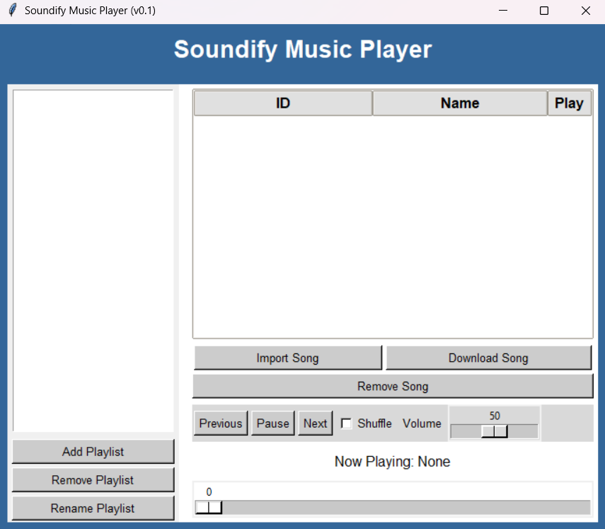

# Soundify

    

Soundify is a Song player without any limitations or ads. Enjoy a seamless music experience with all your favorite features available locally on your device.

## Features
- **Playlist Management**: Create, modify, and delete playlists.
- **Song Management**: Add and remove songs from your playlists.
- **Volume Control**: Increase or decrease audio easily.
- **Playback Modes**: Enjoy your music with either a linear (sequential) or shuffle (random) playback system.
- **YouTube Downloads**: Download songs directly from YouTube.
- **Offline Availability**: Since everything works locally, you can listen offline.
- **Ad-Free**: Enjoy your music without any interruptions from ads.

## Overview
Soundify is designed to provide a user-friendly interface where you can manage your music library effortlessly. Whether you're creating a new playlist or downloading your favorite tracks from YouTube, Soundify offers a streamlined and efficient experience.

## Getting Started
1. **Installation**: Follow the installation guide provided in the [documentation](Installation.md).
2. **Usage**: Start the application

## Contributing
Contributions are welcome! Please see the contribution guidelines for more details on how to help improve Soundify.

## License
This project is licensed under the terms of the [MIT License](LICENSE).
