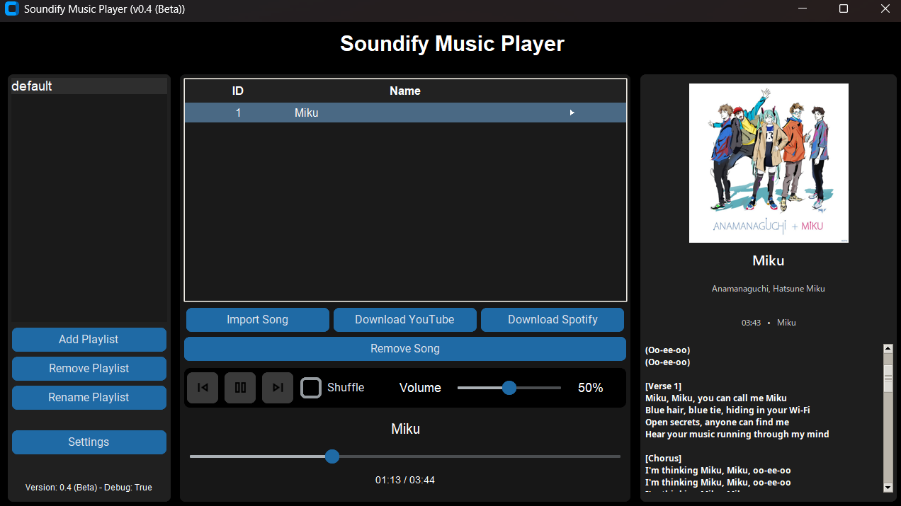

# Soundify

    

Soundify is a Song player without any limitations or ads. Enjoy a seamless music experience with all your favorite features available locally on your device.

## Features
- **Playlist Management**: Create, modify, and delete playlists.
- **Song Management**: Add and remove songs from your playlists.
- **Volume Control**: Increase or decrease audio easily.
- **Volume Booster**: Increases the volume output up to twice as much. (Default: 50 = 100%; Max: 100 = 200%)
- **Playback Modes**: Enjoy your music with either a linear (sequential) or shuffle (random) playback system.
- **YouTube Downloads**: Download songs directly from YouTube.
- **Spotify Downloads**: Download songs directly from Spotify (playlists or songs).
- **Offline Availability**: Since everything works locally, you can listen offline.
- **Ad-Free**: Enjoy your music without any interruptions from ads.
- **Debug Mode**: for developers.

### and more!!!
_check [changelog](changelog.txt) for more info_

## v0.5 Beta Preview

    

## Overview
Soundify is designed to provide a user-friendly interface where you can manage your music library effortlessly. Whether you're creating a new playlist or downloading your favorite tracks from YouTube or Spotify, Soundify offers a streamlined and efficient experience.

## Getting Started
1. **Installation**: Follow the installation guide provided in the [documentation](Installation.md).

## License
No license yet.
